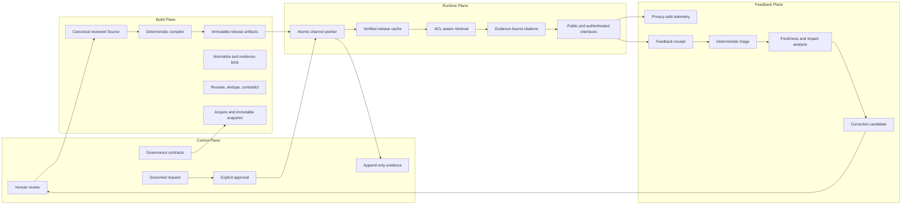
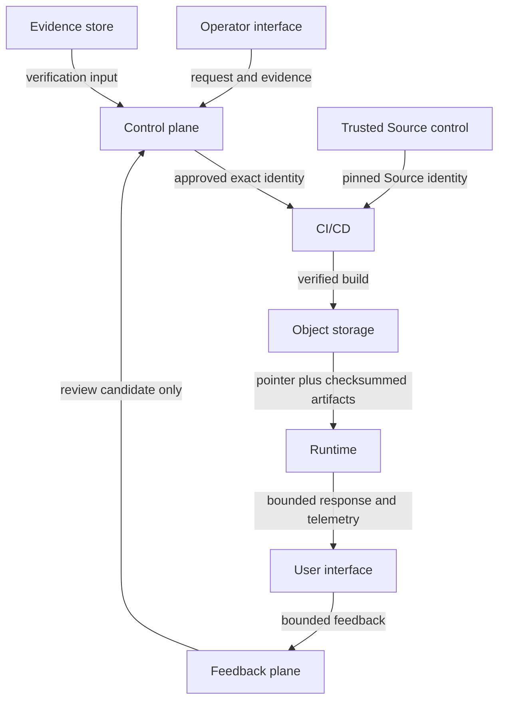
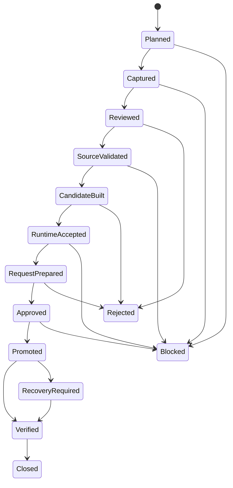

# Knowledge OS Four-Plane System Map

Return to the [Architecture Canon](../README.md).

## System at a glance



The arrows describe information and governed state transitions, not blanket mutation permission.
Only the exact workflow or operator action named by a governed request can cross a mutation
boundary.

## Plane responsibilities

| Plane | Owns | Must not silently do |
|---|---|---|
| Control | lifecycle state, reviews, requests, approvals, expected-previous identity, audit evidence | author canonical knowledge, skip review, infer approval, mutate production without exact preconditions |
| Build | intake, snapshots, normalization, extraction, resolution, synthesis validation, Source validation, compilation, candidate evidence | treat generated content as approved, edit production artifacts in place, broaden audience |
| Runtime | release resolution, integrity verification, cache activation, retrieval, graph expansion, citations, audience filtering, interfaces | fall back to raw Source, bypass ACL, answer from an unverified release, rewrite Source |
| Feedback | bounded telemetry, feedback receipts, triage, freshness impact, correction candidates | store raw secrets/private text, auto-accept corrections, create Source commits, promote releases |

## Repository boundaries

| Boundary | Role | Write authority |
|---|---|---|
| `danielcanfly/knowledge-os-foundation` | normative schemas and policy contracts | separate governed repository process |
| `danielcanfly/knowledge-source` | canonical reviewed knowledge | human-reviewed Source PR only |
| `danielcanfly/knowledge-engine` | compiler, runtime, control-plane contracts, workflows, evidence models, operator tooling | repository PR and workflow permissions; not automatic Source authority |
| object store / Cloudflare R2 | immutable release objects plus small channel-pointer objects | dedicated governed publish, promotion, rollback, or restore action |
| runtime cache | verified local materialization of one immutable release | refresh path only; cache is disposable and non-canonical |
| issue `#30` | permanent append-only production evidence ledger | only its explicit governed evidence contract |

The Engine can prepare Source packages and represent evidence, but it does not make Engine output
canonical merely by generating it.

## Trust boundaries



Crossing a trust boundary requires validated identity, bounded input, privacy-safe evidence, and a
fail-closed decision. Documentation, diagrams, issue text, branch names, and human memory are not
sufficient authority.

## Identity model

| Identity | Purpose | Stability rule |
|---|---|---|
| Source ID | stable origin identity across retrievals | derived from connector type and canonical locator |
| Snapshot ID | immutable captured-version identity | content- and metadata-bound SHA-256 identity |
| Derivative ID | normalized view identity | snapshot, normalizer, version, and normalized hash bound |
| Source commit SHA | exact canonical knowledge version | full Git SHA, never inferred from a moving branch |
| Engine / Builder / Foundation SHA | exact implementation and contract versions | full Git SHA in operation evidence |
| Release ID | immutable compiled release | deterministic timestamp plus bundle content identity |
| Manifest SHA-256 | integrity identity for the release inventory | computed from exact manifest bytes |
| Pointer SHA-256 | identity of selected channel state | computed from exact pointer bytes |
| Operation ID | replay and audit identity | unique per governed mutation intent |
| Expected-previous identity | concurrency and stale-request guard | must equal current governed state at execution |
| Report / artifact SHA-256 | tamper evidence | computed from canonical JSON with digest field cleared |

Branch names, issue numbers, workflow names, and mutable URLs help navigation but do not replace
exact identities.

## Storage model

```text
canonical Source Git tree
  -> deterministic compiler work directory
  -> immutable releases/<release-id>/...
  -> immutable manifest
  -> channels/<channel>.json pointer
  -> verified runtime cache/<release-id>/
```

Raw snapshots, normalized derivatives, review packets, candidate evidence, acceptance reports, and
incident evidence remain outside canonical Source unless a human-reviewed Source PR explicitly
adopts knowledge derived from them.

Object availability alone is insufficient. Runtime activation verifies pointer identity, manifest
identity, release identity, artifact path confinement, byte count, SHA-256, required artifact
kinds, and pointer stability during refresh.

## Release model

1. Pin exact Source, Engine/Builder, and Foundation identities.
2. Validate reviewed Source and audience metadata.
3. Compile deterministic artifacts and manifest.
4. Publish immutable candidate objects.
5. Run candidate runtime, citation, ACL, regression, and quality acceptance.
6. Commit a governed request with exact target and expected-previous identities.
7. Obtain explicit approval for the bounded operation.
8. Re-verify identities and evidence immediately before mutation.
9. Change only the channel pointer through the governed promotion action.
10. Refresh and verify runtime release, cache, query, citation, and ACL behavior.
11. Record bounded immutable evidence.
12. Reject stale, mismatched, replayed, incomplete, or unauthorized operations.

Rollback and restoration follow the same identity and approval discipline. They are not informal
pointer edits.

## ACL model

```text
source access policy
  -> snapshot and evidence audience
  -> claim / concept audience
  -> compiled node and section audience
  -> release artifacts
  -> requester principal audiences
  -> query-time filtering
  -> citation filtering
  -> serialized response
```

Audience can remain equal or become more restrictive. It cannot broaden through normalization,
synthesis, compilation, retrieval, citation enrichment, feedback, or recovery. Unknown or
ambiguous ACL evidence fails closed.

The runtime must filter before retrieval results and citations are serialized. A public interface
cannot use a raw-source fallback to recover otherwise inaccessible content.

## Lifecycle model



A later state requires complete evidence from every required earlier state. Missing, conflicting,
future-dated, stale, identity-drifted, or unauthorized evidence becomes blocked or unknown, never
an optimistic pass.

## Mutation and authority matrix

| Action | Minimum authority and guards |
|---|---|
| write canonical Source | reviewed Source change, authorized Source actor, validation, PR, human approval |
| publish candidate objects | exact Source/Builder/Foundation identity, deterministic build, candidate-only scope |
| promote production | committed request, explicit approval, exact target and expected previous, replay guard, verification plan |
| rollback production | authorized rollback request, exact current and target identities, replay guard, post-rollback verification |
| repair/restore R2 | incident evidence, trusted retained source, explicit bounded authorization, checksum and runtime verification |
| refresh runtime cache | expected release and manifest identity, verified object inventory, pointer-stability check |
| append permanent ledger | exact governed ledger contract and production evidence; issue must remain open |
| create correction candidate | bounded feedback evidence and deterministic triage; no automatic Source or production authority |

## Universal stop conditions

Stop before mutation when any required identity is missing or differs, approval is absent or
out-of-scope, expected previous state is stale, evidence is incomplete, an artifact digest fails,
ACL meaning is unknown, production scope is broader than the request, a replay identity conflicts,
or the post-action verification and rollback path are not ready.

Stopping is a successful safety outcome. Guessing is not.
