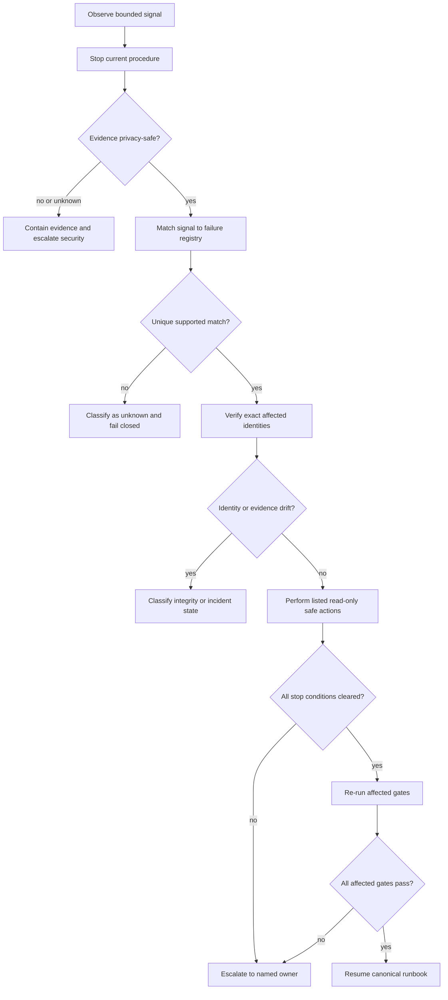

# M17 Failure Triage Flow and Escalation Matrix

Return to the [Troubleshooting Index](../README.md).

## Triage flow

## First five minutes

1. Stop the current stage. Do not trigger another workflow to see whether the problem disappears.
2. Record UTC observation time and the exact Engine, Source, release, manifest, pointer, request,
   operation, batch, or report identities relevant to the symptom.
3. Reduce the symptom to bounded signal codes. Do not paste raw exception text or private payloads.
4. Determine whether production, Source, credentials, private data, or authority evidence may be at
   risk. If yes or unknown, escalate immediately.
5. Select the matching atlas entry and collect only the evidence named there.

## Severity matrix

| Severity | Typical condition | Required response |
|---|---|---|
| low | informational discrepancy with no authority or integrity impact | record and repair through normal review |
| medium | bounded workflow or feedback blockage | stop the affected path and notify the owning maintainer |
| high | service degradation, missing approval, replay conflict, or documentation drift | block progression, preserve evidence, escalate promptly |
| critical | production uncertainty, integrity failure, ACL breach, secret exposure, Source corruption, object loss, or control-plane loss | contain immediately and engage incident/security ownership |

Severity does not override state. An `unknown` production identity remains fail-closed even when no
user-visible outage is observed.

## Escalation targets

| Target | Owns | Does not automatically authorize |
|---|---|---|
| `engine_maintainer` | compiler, runtime, validator, CI, documentation, and deterministic rebuild diagnosis | Source merge, production mutation, credential rotation |
| `source_owner` | canonical Source integrity, review history, provenance, and reviewed correction path | production promotion or object-store repair |
| `release_authority` | promotion or rollback request scope, approval, exact target, and expected-previous identity | Source authorship or security incident closure |
| `security_owner` | ACL, privacy, secret exposure, prompt injection, spoofing, and unsafe fallback response | silent credential rotation or evidence deletion |
| `feedback_owner` | feedback intake quality, bounded evidence, deduplication, and correction-candidate review | automatic Source correction or production mutation |
| `incident_commander` | cross-plane containment, state classification, recovery coordination, and closeout evidence | bypass of specialist approval or integrity gates |

## State classification rules

### Authorization

Use when the proposed action lacks explicit approval, exact operation identity, or exact
expected-previous state. Do not downgrade this to a documentation problem.

### Blocked

Use when the failure is upstream of mutation and production remains proven unchanged. Blocked is not
failed production and does not require compensation unless evidence shows mutation occurred.

### Degraded

Use when service is available but cache, query, citation, quality, or health acceptance is incomplete.
Do not close a batch or start another promotion from degraded state.

### Integrity

Use when bytes, digests, identities, ancestry, citations, evidence chains, or pointer state disagree.
All downstream claims depending on the mismatch become untrusted until re-verified.

### Security

Use for audience broadening, insufficient privilege, private or secret material, prompt override,
role/tool spoofing, citation fabrication, restricted citation, or unsafe fallback. Block serialization
and avoid copying the sensitive material into the incident record.

### Incident

Use when active production, object storage, Source history, control-plane evidence, or recovery
capability may be damaged. Containment precedes recovery planning.

### Unknown

Use when observations are missing, conflicting, stale, privacy-unsafe, future-dated, or identity
unbound. Unknown never means healthy, no-change, or permission to proceed.

## Evidence collection template

Record a bounded troubleshooting packet with:

- failure registry ID and signal codes;
- observed UTC time;
- exact affected identities;
- privacy classification;
- evidence references and their digests;
- state and severity;
- safe actions performed;
- stop conditions still true;
- escalation target and handoff time;
- affected gates to re-run;
- final resolution or explicit unresolved status.

Do not include credentials, authentication-token values, cookies, raw private text, raw queries, raw
answers, private object locations, hostnames, or full unbounded traces.

## Resumption criteria

Resume the normal operator runbook only when:

1. the original signal no longer reproduces against the same bounded test;
2. exact identities are known and consistent;
3. privacy and ACL evidence are complete;
4. all named stop conditions are false;
5. required approval and expected-previous state are current;
6. affected integrity, runtime, citation, query, ACL-negative, replay, and evidence gates pass;
7. recovery or correction evidence is immutable and independently verifiable;
8. the named escalation owner has closed or transferred the incident explicitly.

A workaround that hides the signal without restoring these invariants is not resolution.
